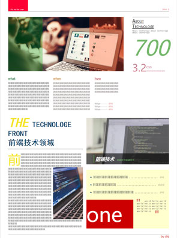
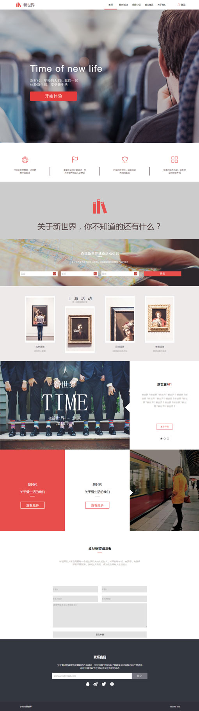

# 目录
[TOC]

# 静态网页
单纯练习html css js。只是一个静态网页，而且只有一页。
> * [文字排版](http://chjabc.github.io/practice1)
> > <http://chjabc.github.io/practice1>  
> > 
> 
> * [制作复杂表格排版](http://chjabc.github.io/practice2)
> > 这里用了点css3 属性，和比较新的选择器，需要在ie9以上浏览器浏览。 
> > <http://chjabc.github.io/practice2> 
> > 
> 
> * [新世界](http://chjabc.github.io/practice3/)
> > 这里用了点css3 属性，和比较新的选择器，需要在ie10以上浏览器浏览。 
> > <http://chjabc.github.io/practice3> 
> > 
> 
> * [shopping](http://chjabc.github.io/practice4)
> > 很多效果是通过js写的，可以兼容到ie8。 
> > <http://chjabc.github.io/practice4> 
> > 

# js库封装
> 根据教学视频，边根据自己所想。把常用的函数封装起来。其中包括节点的获取，事件封装兼容，元素拖动插件，Ajax封装等等。 
> <https://github.com/CHJABC/-Basejs>

# php项目
> php刚接触，努力学习中...